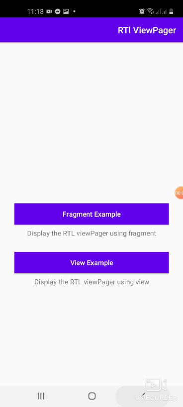

# RTLViewPager
[](https://developer.android.com/index.html)

[](http://www.apache.org/licenses/LICENSE-2.0)

RTLViewPager is a helpful library built on the top of the ViewPager. It extends the functionality of it. Display Views or Fragments in a swipeable format
and handle the RTL (right-to-left) layout support.





## Setup

To import the RTLViewPager library to Android Studio, follow the following steps:

1. Open your project in Android Studio
2. Download the library (using Git, or a zip archive to unzip)
3. Go to File > Import Module and import the library as a module
4. Right-click your app in project view and select "Open Module Settings"
5. Click the "Dependencies" tab and then the '+' button
6. Select "Module Dependency"
7. Select "rtlviewpager"


## How to use

**1- Add rtlviewpager view to your xml file**

### XML
```xml
  <com.linkdev.rtlviewpager.views.RtlViewPager
        android:id="@+id/viewPager"
        android:layout_width="match_parent"
        android:layout_height="0dp"
        app:layout_constraintEnd_toEndOf="parent"
        app:layout_constraintStart_toStartOf="parent"
        app:layout_constraintTop_toBottomOf="@+id/tabLayout"
        app:tabGravity="fill" />
```

use the rtlviewpager in your layout to handle the RTL swipe direction.<br />
### Note
take in your consideration that you need to override the onConfigurationChanged method
in your application class to provide the language again because in case of the mobile rotate and the selected language is RTL the viewPager will take the mobile default language
and ignore the RTL language so we need to provide the language in case of configuration changes.

### Kotlin
```kotlin
   override fun onConfigurationChanged(newConfig: Configuration) {
        val configuration: Configuration = newConfig
        val appLanguage = iPreferenceDataSource.getLanguage(Constants.Languages.DEFAULT_LANGUAGE)
        if (appLanguage.isNotEmpty()) {
            val newLocale = Locale(appLanguage)
            if (Build.VERSION.SDK_INT >= Build.VERSION_CODES.N) {
                configuration.apply {
                    val localeList = LocaleList(newLocale)
                    LocaleList.setDefault(localeList)
                    setLocale(newLocale)
                    setLocales(localeList)
                }
            } else {
                configuration.setLocale(newLocale)
            }
        }
        super.onConfigurationChanged(configuration)
    }
```


## License
Copyright 2020 Link Development

Licensed under the Apache License, Version 2.0 (the "License");
you may not use this file except in compliance with the License.
You may obtain a copy of the License at

    http://www.apache.org/licenses/LICENSE-2.0

Unless required by applicable law or agreed to in writing, software
distributed under the License is distributed on an "AS IS" BASIS,
WITHOUT WARRANTIES OR CONDITIONS OF ANY KIND, either express or implied.
See the License for the specific language governing permissions and
limitations under the License.