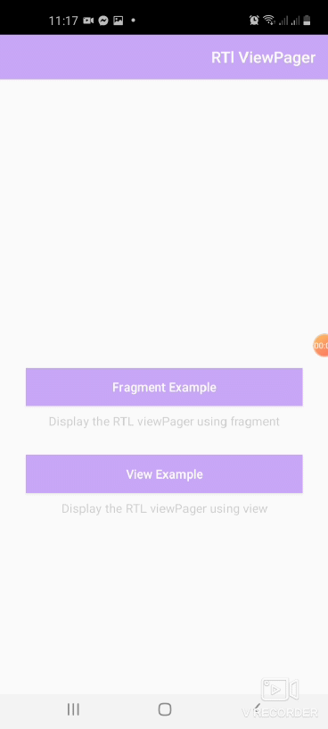

# RTLViewPager
[](https://developer.android.com/index.html)

[](http://www.apache.org/licenses/LICENSE-2.0)

RTLViewPager is a helpful library built on the top of the ViewPager. It extends the functionality of it. Display Views or Fragments in a swipeable format
and handle the RTL (right-to-left) layout support.





#Setup

Gradle:
```
implementation 'com.linkdev.rtlviewpager:rtlviewpager:1.0.0'
```
Maven:
```
<dependency>
  <groupId>com.linkdev.rtlviewpager</groupId>
  <artifactId>rtlviewpager</artifactId>
  <version>1.0.0</version>
  <type>pom</type>
</dependency>
```


## How to use

**1- Add rtlviewpager view to your xml file**

### XML
```xml
  <com.linkdev.rtlviewpager.views.RtlViewPager
        android:id="@+id/viewPager"
        android:layout_width="match_parent"
        android:layout_height="0dp"
        app:layout_constraintEnd_toEndOf="parent"
        app:layout_constraintStart_toStartOf="parent"
        app:layout_constraintTop_toBottomOf="@+id/tabLayout"
        app:tabGravity="fill" />
```

use the rtlviewpager in your layout to handle the RTL swipe direction.<br />
### Note
Take in your consideration that in case of the configuration changes and the selected language is RTL you need to check if the RTLViePager language is set to the mobile default language not the (RTL)selected language.
so you need to override the onConfigurationChanged method in your application class to provide the language again to resolve this issue otherwise no need for that.

### Kotlin
```kotlin
   override fun onConfigurationChanged(newConfig: Configuration) {
        val configuration: Configuration = newConfig
        val appLanguage = iPreferenceDataSource.getLanguage(Constants.Languages.DEFAULT_LANGUAGE)
        if (appLanguage.isNotEmpty()) {
            val newLocale = Locale(appLanguage)
            if (Build.VERSION.SDK_INT >= Build.VERSION_CODES.N) {
                configuration.apply {
                    val localeList = LocaleList(newLocale)
                    LocaleList.setDefault(localeList)
                    setLocale(newLocale)
                    setLocales(localeList)
                }
            } else {
                configuration.setLocale(newLocale)
            }
        }
        super.onConfigurationChanged(configuration)
    }
```


## License
Copyright 2020 Link Development

Licensed under the Apache License, Version 2.0 (the "License");
you may not use this file except in compliance with the License.
You may obtain a copy of the License at

    http://www.apache.org/licenses/LICENSE-2.0

Unless required by applicable law or agreed to in writing, software
distributed under the License is distributed on an "AS IS" BASIS,
WITHOUT WARRANTIES OR CONDITIONS OF ANY KIND, either express or implied.
See the License for the specific language governing permissions and
limitations under the License.